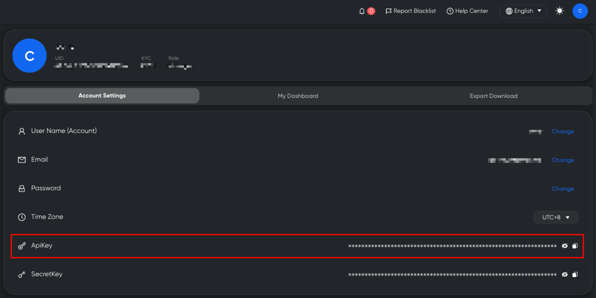

# 域名&鉴权\&APPID

### 1、**API 域名** <a href="#api-yu-ming" id="api-yu-ming"></a>

​https://openapi.trustformer.info


### 2、接口鉴权 <a href="#jie-kou-jian-quan" id="jie-kou-jian-quan"></a>

登录KYT系统后，在帐号设置页面，可以获取apikey。

在请求接口时，在url上传递apikey参数即可。

说明：V3版相比V2版，不再使用secrtekey参数。

<figure><figcaption></figcaption></figure>


#### 鉴权异常

当apikey过期或错误，接口返回：

```
{
    "code": -1,
    "data": {},
    "message": "api_key is invalid"
}
```


### 3、APPID参数 <a href="#jie-kou-jian-quan" id="jie-kou-jian-quan"></a>

在KYT系统的规则引擎页面，创建APP后（APP本质是一套风险类型阈值的规则配置），会在页面上方显示APPID。

调用OPENAPI的接口，如果传参APPID，则风控模型会根据用户配置的规则，对筛查的风险等级进行动态调整，来满足用户个性化的风险告警需求。

<figure><figcaption></figcaption></figure>

